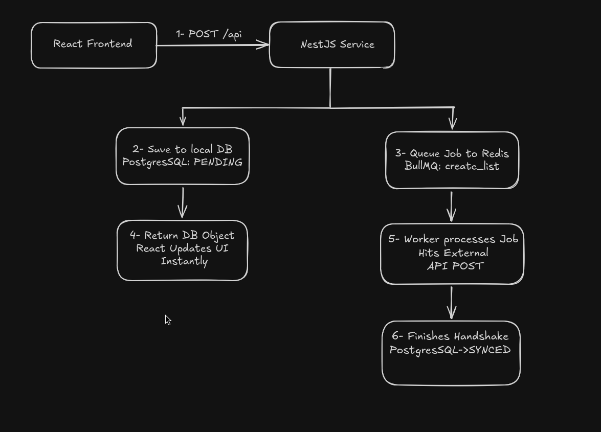
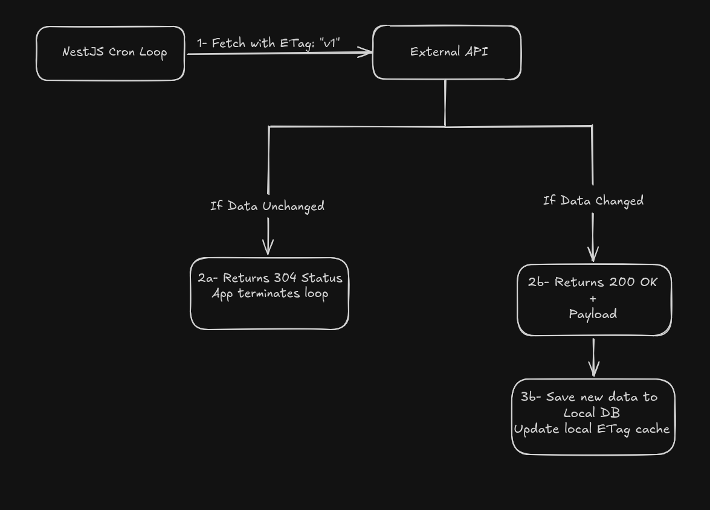

# Sync POC

### Summary
After reviewing the key objectives written in the [repository](https://github.com/crunchloop/challenge-senior-engineer), two design solutions came to mind: Event-Driven Sync and Periodic Batch Reconciliation. I decided that Event-Driven Sync was best for the key objectives because it provides near real-time synchronization, fewer API calls, isolates our app from external failures, ensures data is never lost, and scales efficiently.

In the POC, I decided to split responsibilities into:
* **Outbound** sync via an instant event queue, moving changes from local to external.
* **Inbound** sync via a cron job, bringing changes from external to our local app.

We added 3 new columns to our entities: isDeletedLocally, externalId, syncStatus.

* `isDeletedLocally`: We soft delete the entities to ensure the deletion is processed by both the local and external APIs before permanently hard deleting them. 
* `externalId`: This acts as the unique mapping bridge between our local API and the external API. It helps track which resources changed on the external API side and prevents creating duplicate records during inbound sync.
* `syncStatus`: A transactional state machine indicator (`PENDING`, `SYNCED`, `FAILED`) used to track the lifecycle of a record's synchronization. It prevents redundant out-of-order network calls, helps the worker identify records that require immediate attention after a system recovery, and allows the UI to conditionally display sync states if needed.

---
### Outbound Sync

When a user creates or modifies a todo list or an item, we update our local API and database instantly. Using BullMQ and Redis, we then queue a background job to sync the new change to the external API. We first save the local data with `externalId: null` and `syncStatus: PENDING`. After we receive a successful response containing the new ID from the external API, we update our local `externalId` and set the `syncStatus` to `SYNCED`.

If it fails, we use exponential backoff retries until the server recovers (for example: retrying in 2 seconds, then 4 seconds, then 8 seconds, and so on).

The benefit of doing it this way is that the user and the frontend do not notice the background synchronization, eliminating response delays. Furthermore, the POC ensures that when a todo list with items is deleted, we only make a single API call to delete the parent list, leaving the external API to cascade the deletion of its nested items. Avoiding separate calls for every item directly prevents N+1 network operations.

---
### Inbound Sync

We use a cron loop to periodically check the external API for new changes. We do this efficiently by leveraging HTTP header caching via ETags and the `If-None-Match` header. Every time the external API's data changes, its ETag header fingerprint updates. When our cron loop requests an update, it checks the ETag; if it is different, the loop fetches the fresh data, but if it is the same, it skips processing until the next loop.

This mechanism ensures we are not fetching heavy datasets when no changes have occurred. If no updates exist externally, the server simply returns a `304 Not Modified` status.

In the event that the external API lacks support for native HTTP conditional caching handshake mechanisms (like ETag or If-None-Match headers), the system can fall back to Change Data Capture.

Under this approach, we rely on a modification timestamp (such as `changedAt` or `updatedAt`) provided by the external API objects. Locally, our system maintains a single state persistence token tracking our `lastSuccessfulSyncAt` timestamp.

During each cron iteration, our inbound processor would query the external data layer and filter or inspect only the records where `changedAt` > `lastSuccessfulSyncAt`. This ensures that we are still minimizing data processing overhead by isolating and reconciling only the "deltas" (the newly modified records) rather than re-processing the entire dataset on every loop.

## Inbound Cycle Diagram

## Outbound Cycle Diagram

### Git Workflow Note
* Commit Strategy: You will notice the implementation is captured in a singular monolithic commit on the feature branch. During the initial PoC phase, I focused on local prototyping, testing dependency interactions (BullMQ, NestJS modules, TypeORM entities), and stabilizing the runtime environment under a continuous local feedback loop.

* Production Preference: In a collaborative production environment, I strictly follow micro-commits mapping to atomic structural changes (e.g., separate commits for entity configuration, service layer migrations, module wiring, and spec suites) to ensure clean peer review cycles and precise rollbacks.

### AI Chat used:
Since I don't use nor have a IDE with AI I use the gemini web chat.
[Link to chat](https://share.gemini.google/hEeAai4tRovz)
